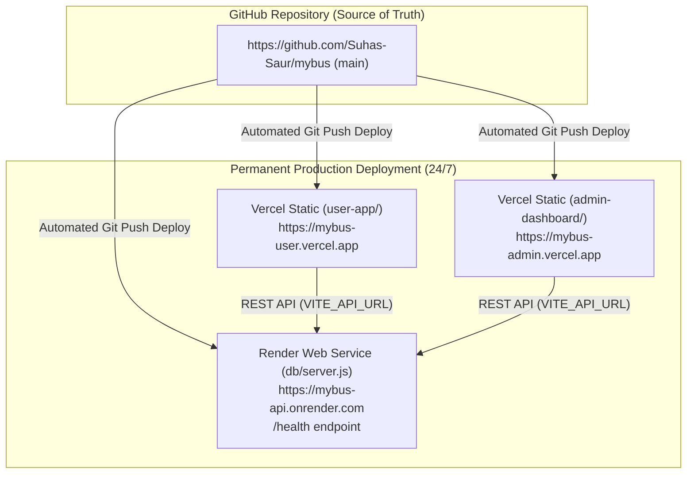

# 🚌 BMTC Smart Transit — Seat Booking & AI Tracking System

A full-stack, real-time bus seat booking and AI-powered occupancy tracking platform designed for the Bangalore Metropolitan Transport Corporation (BMTC).

---

## 🌐 Environments: Local vs Development vs Production

Understanding the distinct environments ensures your live demos remain permanently accessible:

| Environment | Host / URL | Persistence | Purpose |
| :--- | :--- | :--- | :--- |
| **LOCAL** | `localhost:6173`, `localhost:6175`, `localhost:6001` | Only while terminal commands run | Local coding and rapid iteration |
| **DEVELOPMENT** | Antigravity Preview / Background tasks | Active only while this Antigravity session is open | Pair programming & AI prototyping |
| **PRODUCTION** | Permanent Cloud URLs (e.g. `*.vercel.app`, `*.onrender.com`) | **24/7 Permanent & Independent** | Live public demo that stays online when Antigravity closes or switches projects |

---

## 🏛️ System Architecture



The system comprises 4 components:
1. **`db`**: Node.js JSON database API (`server.js`) with health monitoring (`/health`), dynamic port, and production CORS policies.
2. **`user-app`**: Passenger web application built with Vite + React, Framer Motion, and Tailwind CSS.
3. **`admin-dashboard`**: Fleet & route operations dashboard built with Vite + React, Recharts, Leaflet, and Roboflow AI inference.
4. **`ai-scanner`**: Edge/standalone Python Flask service running OpenCV and YOLO for real-time bus seat occupancy tracking.

---

## 🚀 Permanent Cloud Deployment Guide (Zero-Antigravity)

Follow this 2-step setup once. After connecting, **every `git push` to your repository automatically updates your permanent live deployment**.

### Step 1: Deploy Backend API on Render (Takes ~2 minutes)
1. Sign in to [render.com](https://render.com) (free).
2. Click **New +** → **Web Service**.
3. Connect your GitHub repository: `Suhas-Saur/mybus`.
4. Configure the service:
   - **Name**: `mybus-api` (or your choice)
   - **Root Directory**: `db`
   - **Runtime**: `Node`
   - **Build Command**: `npm install`
   - **Start Command**: `npm start`
   - **Instance Type**: `Free`
5. Click **Deploy Web Service**.
6. Once deployed, copy your permanent backend URL (e.g. `https://mybus-api.onrender.com`).
   - You can test it by visiting: `https://mybus-api.onrender.com/health` (should return `{"status":"ok"}`).

> **Alternative (1-Click Blueprint):**
> In Render, choose **New +** → **Blueprint**, select `Suhas-Saur/mybus`, and Render will automatically read `render.yaml` to deploy the backend and static sites together!

---

### Step 2: Deploy Frontends on Vercel (Takes ~2 minutes)

#### 2A. Deploy Passenger App (`user-app`)
1. Sign in to [vercel.com](https://vercel.com) (free).
2. Click **Add New…** → **Project**, and import `Suhas-Saur/mybus`.
3. Under **Root Directory**, click **Edit** and select `user-app`.
4. Under **Environment Variables**, add:
   - `VITE_API_URL`: Your Render backend URL from Step 1 (e.g. `https://mybus-api.onrender.com`)
5. Click **Deploy**. Vercel will assign a permanent URL (e.g. `https://mybus-user.vercel.app`).

#### 2B. Deploy Admin Dashboard (`admin-dashboard`)
1. In Vercel, click **Add New…** → **Project**, and import `Suhas-Saur/mybus` again.
2. Under **Root Directory**, click **Edit** and select `admin-dashboard`.
3. Under **Environment Variables**, add:
   - `VITE_API_URL`: Your Render backend URL (e.g. `https://mybus-api.onrender.com`)
   - `VITE_ROBOFLOW_API_KEY`: `zVvLiWzoQ9tohiNzcgBR`
4. Click **Deploy**. Vercel will assign a permanent URL (e.g. `https://mybus-admin.vercel.app`).

---

## 🔑 Default Credentials

- **Passenger Portal**: `arjun@bmtc.in` / `password123` (or click **⚡ Instant Login**)
- **Admin Dashboard**: `admin@bmtc.in` / `admin123` (or click **⚡ Instant Login**)

---

## 💻 Local Development Setup

If running locally on your laptop:

```bash
# 1. Start Database API (Port 6001)
cd db
npm install
npm start

# 2. Start Passenger Portal (Port 6173)
cd user-app
npm install
npm run dev

# 3. Start Admin Dashboard (Port 6175)
cd admin-dashboard
npm install
npm run dev

# 4. Optional: Start AI Scanner (Port 6050)
cd ai-scanner
python -m venv venv
.\venv\Scripts\activate
pip install -r requirements.txt
python app.py --demo
```

Local access links:
- Passenger App: `http://localhost:6173`
- Admin Dashboard: `http://localhost:6175`
- Database API: `http://localhost:6001`
- AI Scanner: `http://localhost:6050`

---

## 📋 Universal Blueprint: Permanent Demos for Any Future Repository

For every repository you create (`project-1`, `project-2`, etc.):

1. **Frontend Projects (React, Vue, Next.js, Vite)**:
   - Push repository to GitHub.
   - Import repository into Vercel or Netlify.
   - Set build command `npm run build` and output directory `dist` (or `.next`).
   - Add `vercel.json` with SPA rewrites if using client-side routing.
   - Vercel automatically deploys every commit to a permanent domain.

2. **Full-Stack Projects (Node.js, Express, Python, DB)**:
   - Push repository to GitHub.
   - Deploy backend to Render or Railway with health check (`/health`).
   - Provide `.env.example` documenting `PORT`, `DATABASE_URL`, etc.
   - In the frontend deployment, set `VITE_API_URL` (or `NEXT_PUBLIC_API_URL`) to the deployed backend URL.

3. **Independence Rule**:
   - Never hardcode `localhost` in client files. Always read from `import.meta.env` or `process.env`.
   - Never use Antigravity preview URLs as production demo links.
   - One GitHub Repository = One Cloud Deployment = Permanent 24/7 Live URL.