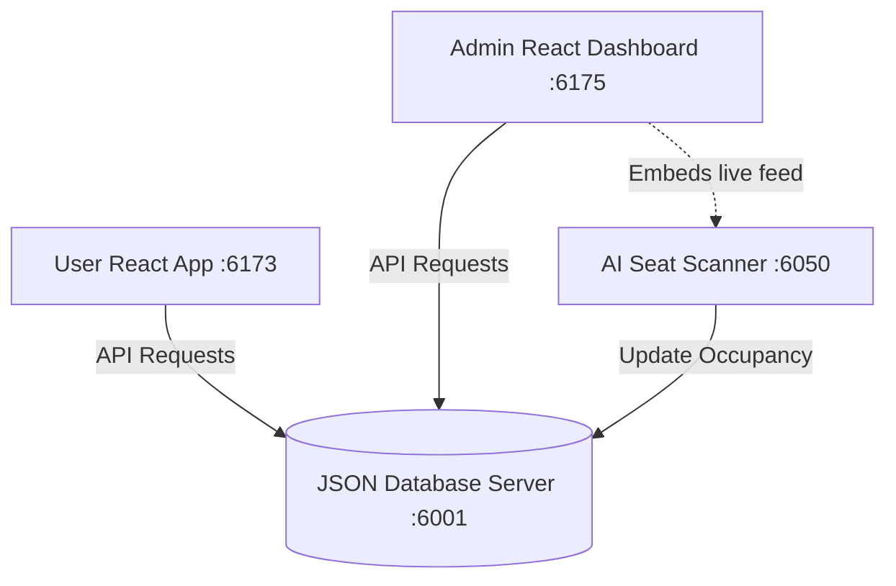

# 🚌 BMTC Smart Transit — Seat Booking & AI Tracking System

An advanced, real-time bus seat booking and AI-powered occupancy tracking platform designed for the Bangalore Metropolitan Transport Corporation (BMTC).

---

## 🚀 Quick Launch Links (Local Development)

Click the buttons below to open the services in your browser when running locally:

[](http://localhost:6173)
[](http://localhost:6175)
[](http://localhost:6050)
[](http://localhost:6001)

---

## 🛠️ Project Architecture & Components

The platform consists of four distinct sub-projects working in sync:



1. **`db`**: A JSON-server instance providing RESTful endpoints for users, bookings, routes, buses, and staff.
2. **`user-app`**: The passenger portal for searching routes, checking live seat layouts, and booking tickets.
3. **`admin-dashboard`**: The control center for BMTC staff to monitor fleet status, view routes on interactive Leaflet maps, and manage bookings.
4. **`ai-scanner`**: A Flask service using OpenCV and YOLO to detect bus seat occupancy from a live video stream, syncing results to the DB in real-time.

---

## 🔑 Default Credentials

### Passenger Account
- **Email**: `arjun@bmtc.in`
- **Password**: `password123`

### Administrator Account
- **Email**: `admin@bmtc.in`
- **Password**: `admin123`

---

## ⚙️ How to Run Locally

If you need to start the services again, run the following commands in separate terminals:

### 1. Database Server
```bash
cd db
npm install
npm start
```

### 2. User Portal
```bash
cd user-app
npm install
npm run dev
```

### 3. Admin Control Center
```bash
cd admin-dashboard
npm install
npm run dev
```

### 4. AI Seat Scanner (Python)
```bash
cd ai-scanner
python -m venv venv
.\venv\Scripts\activate
pip install -r requirements.txt
python app.py --demo
```