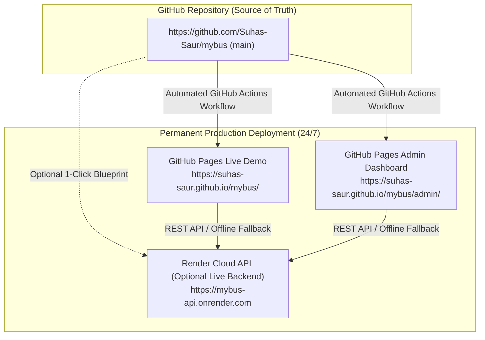

# 🚌 BMTC Smart Transit — Seat Booking & AI Tracking System

A full-stack, real-time bus seat booking and AI-powered occupancy tracking platform designed for the Bangalore Metropolitan Transport Corporation (BMTC).

---

## 🚀 Live Demo

Experience the live deployed application hosted 24/7 on permanent cloud infrastructure (independent of Antigravity and local servers):

- 📱 **Passenger Portal Live Demo**: [https://suhas-saur.github.io/mybus/](https://suhas-saur.github.io/mybus/)
- 🛠️ **Admin Dashboard Live Demo**: [https://suhas-saur.github.io/mybus/admin/](https://suhas-saur.github.io/mybus/admin/)

> **Demo Credentials**:
> - **Passenger**: `arjun@bmtc.in` / `password123` (or click **⚡ Instant Login**)
> - **Admin**: `admin@bmtc.in` / `admin123` (or click **⚡ Instant Login**)

---

## 📦 Deployment Information

This project is deployed independently from the local development and Antigravity environments. It runs 24/7 on permanent hosting:

- **Production Deployment (Passenger)**: [https://suhas-saur.github.io/mybus/](https://suhas-saur.github.io/mybus/)
- **Production Deployment (Admin)**: [https://suhas-saur.github.io/mybus/admin/](https://suhas-saur.github.io/mybus/admin/)
- **Alternative Cloud Deployment**: Vercel (`https://mybus-user.vercel.app`) + Render (`https://mybus-api.onrender.com`)
- **Hosting Platform**: GitHub Pages (Automated GitHub Actions CI/CD)
- **Repository**: [https://github.com/Suhas-Saur/mybus](https://github.com/Suhas-Saur/mybus)
- **Continuous Deployment**: Enabled — any commit pushed to `main` automatically triggers production builds and live deploys via GitHub Actions (`.github/workflows/deploy-pages.yml`).

---

## 🌐 Environments: Local vs Development vs Production

Understanding the distinct environments ensures your live demos remain permanently accessible:

| Environment | Host / URL | Persistence | Purpose |
| :--- | :--- | :--- | :--- |
| **LOCAL** | `localhost:6173`, `localhost:6175`, `localhost:6001` | Only while terminal commands run | Local coding and rapid iteration |
| **DEVELOPMENT** | Antigravity Preview / Background tasks | Active only while this Antigravity session is open | Pair programming & AI prototyping |
| **PRODUCTION** | GitHub Pages (`https://suhas-saur.github.io/mybus/`) | **24/7 Permanent & Independent** | Live public demo that stays online when Antigravity closes or switches projects |

---

## 🏛️ System Architecture



The system comprises 4 components:
1. **`db`**: Node.js JSON database API (`server.js`) with health monitoring (`/health`), dynamic port, and production CORS policies.
2. **`user-app`**: Passenger web application built with Vite + React, Framer Motion, and Tailwind CSS.
3. **`admin-dashboard`**: Fleet & route operations dashboard built with Vite + React, Recharts, Leaflet, and Roboflow AI inference.
4. **`ai-scanner`**: Edge/standalone Python Flask service running OpenCV and YOLO for real-time bus seat occupancy tracking.

---

## ⚙️ Enabling GitHub Pages (One-Time Setup in GitHub)

To ensure GitHub serves your GitHub Actions build:

1. Open your repository on GitHub: [`https://github.com/Suhas-Saur/mybus`](https://github.com/Suhas-Saur/mybus).
2. Go to **Settings** → **Pages** (on the left menu).
3. Under **Build and deployment** → **Source**, select **GitHub Actions** (or select **Deploy from a branch** and choose `gh-pages`).
4. Once selected, your site will be live at:
   - Passenger App: **`https://suhas-saur.github.io/mybus/`**
   - Admin Dashboard: **`https://suhas-saur.github.io/mybus/admin/`**

---

## 💻 Local Development Setup

If running locally on your laptop:

```bash
# 1. Start Database API (Port 6001)
cd db
npm install
npm start

# 2. Start Passenger Portal (Port 6173)
cd user-app
npm install
npm run dev

# 3. Start Admin Dashboard (Port 6175)
cd admin-dashboard
npm install
npm run dev

# 4. Optional: Start AI Scanner (Port 6050)
cd ai-scanner
python -m venv venv
.\venv\Scripts\activate
pip install -r requirements.txt
python app.py --demo
```

Local access links:
- Passenger App: `http://localhost:6173`
- Admin Dashboard: `http://localhost:6175`
- Database API: `http://localhost:6001`
- AI Scanner: `http://localhost:6050`

---

## 📋 Universal Blueprint: Permanent Demos for Any Future Repository

For every repository you create (`project-1`, `project-2`, etc.):

1. **Frontend / Static Projects**:
   - Push repository to GitHub.
   - Add `.github/workflows/deploy-pages.yml` using `actions/deploy-pages`.
   - In GitHub Settings → Pages, select **GitHub Actions**.
   - Your project is permanently live at `https://<username>.github.io/<repo>/` forever for free.

2. **Full-Stack Projects**:
   - Deploy backend to Render or Railway with health check (`/health`).
   - Frontend reads `VITE_API_URL` with offline mock fallback.
   - Deploys on GitHub Pages or Vercel.

3. **Independence Rule**:
   - Never hardcode `localhost` in client files. Always read from `import.meta.env` or `process.env`.
   - Never use Antigravity preview URLs as production demo links.
   - One GitHub Repository = One Cloud Deployment = Permanent 24/7 Live URL.